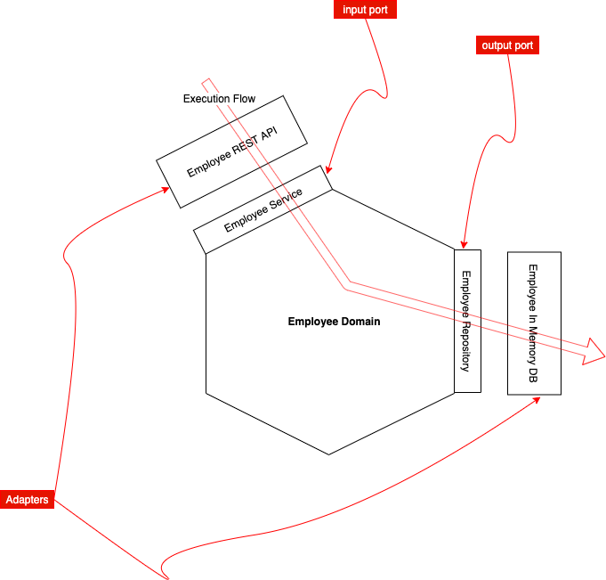

# NestJS -Clean code using Hexagonal Architecture

Software architecture is key in responding to dynamic market pressures, a well-designed software allows the company to deliver new features faster to meet evolving user needs.

I remember in my early days as an SDE, I was always looking for how can I better structure my code, to make it easy to understand and add new features for my colleges and future me. so I was constantly refactoring my working feature trying to find the perfect Application Architecture. yes, I was young and stupid, and I am today as well. ‍😄
Then later I discovered **SOLID** principles, **clean code**, **Domain-Driven Design** and the **HA** (Hexagonal Architecture). this was a big discovery for me because that was exactly what I was looking for.

I know many of you already read about clean code, SOLID and HA. but today I decided to write an article where I'll be explaining step by step how to implement these principles using HA with [NestJS](https://github.com/nestjs/nest).

#### Before we go further, why should I use HA? 💁🏽‍♂️

With the adoption of cloud-managed services in our applications, it makes more sense to use HA because it allows us to replace and maintain infrastructure components code in complete isolation from our business logic code, which protects our features from regression. 
Infrastructure components code examples: storing blob objects into AWS S3 bucket, publishing an event into an AWS SNS topic…
All this code has nothing to do with our Business features (Domain)and has NO direct business value. 
Storing our users' images in S3 or in desk, publishing users events into SNS or SQS, migrating from SNS to EventBridge, trigger the business logic synchronously from an HTTP call or asynchronously from an Event. all these NFRs (Non-functional requirements) are requested by a technical person, an Architect, a technical lead or a developer. and all its related code should reside in a dedicated package (the adapters).
On the other hand, 
Another reason is unit tests, HA make writing unit tests easy as it allows you to test your Business code

#### Application Architecture?



The application code is split into two main components, the Application Core Domain and the Adapters, the idea is to design our code to be close to modification but open for extension.
How?
The output ports allow us to extend our code by adding Adapters as needed then use DI (dependency injection) to orchestrate which Adapter implementation to execute.
the

#### Coding time!

To start we need an existing or new [Nest](https://github.com/nestjs/nest) application, then create a new module, in my case I created a module named `employee`

```bash
$ nest generate modue
```

## Support

Nest is an MIT-licensed open source project. It can grow thanks to the sponsors and support by the amazing backers. If you'd like to join them, please [read more here](https://docs.nestjs.com/support).

## Stay in touch

- Author - [Kamil Myśliwiec](https://kamilmysliwiec.com)
- Website - [https://nestjs.com](https://nestjs.com/)
- Twitter - [@nestframework](https://twitter.com/nestframework)

## License

Nest is [MIT licensed](LICENSE).
